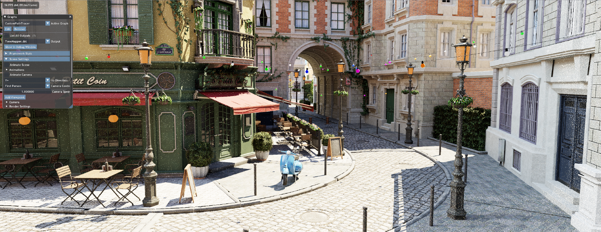

# Falcor-playground
# Abstruct/概要

リアルタイムレンダリングの勉強のために、Falcorを使っていろいろ実装してみるリポジトリです。
[Nvidia Falcor](https://github.com/NVIDIAGameWorks/Falcor)を使用しています。

A repository for the study of Real-time rendering and Computer graphics theory.

I use [Nvidia Falcor](https://github.com/NVIDIAGameWorks/Falcor) for the framework and I implement the custom render pass.

---
### Simple PathTracer

[詳細はこちら](https://blog.udemegane.net/p/falcor%E3%81%A7gpu%E3%83%91%E3%82%B9%E3%83%88%E3%83%AC%E3%83%BC%E3%82%B5%E3%83%BC%E3%81%AE%E5%AE%9F%E8%A3%85/)

---
# My Environment/環境
- Windows 11 build 22621
- NVIDIA Driver 517.0
- Visual Studio Community 2022 17.4.4 (for MSVC)
- CLion & VSCode (for slang shader)
- Ryzen9 3900X / RTX2080
- Falcor 5.2

