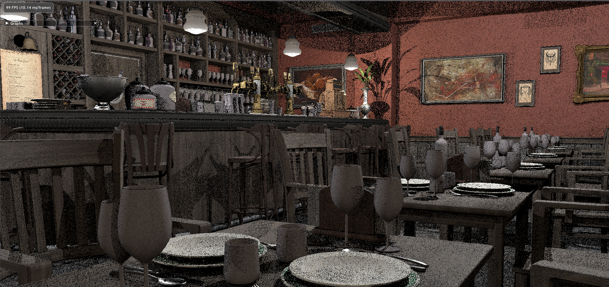

# Falcor-playground
# Abstruct/概要

リアルタイムレンダリングの勉強のために実装したものを置くリポジトリです。
[Nvidia Falcor](https://github.com/NVIDIAGameWorks/Falcor)を使用しています。

A repository for the study of Real-time rendering and Computer graphics theory.

I use [Nvidia Falcor](https://github.com/NVIDIAGameWorks/Falcor) for the framework and I implement the custom render pass.

---
### ReSTIR GI 🚧

[ReSTIRをベースにした効率的なパスサンプリング手法(for Indirect Lighting)](https://research.nvidia.com/publication/2021-06_restir-gi-path-resampling-real-time-path-tracing)です。

- [x] Temporal Resampling
- [x] Spatial Resampling
- [ ] Spatial Resampling (Unbiased)
- [ ] Sample Varification

---
### ReSTIR

低分散なレイトレーシング手法である[ReSTIR](https://research.nvidia.com/publication/2020-07_spatiotemporal-reservoir-resampling-real-time-ray-tracing-dynamic-direct)の再現です。
[詳細はこちら](https://blog.udemegane.net/p/restir%E3%82%92%E5%AE%9F%E8%A3%85%E3%81%99%E3%82%8B-%E3%81%9D%E3%81%AE1/)
- [x] WRS
- [x] Temporal Reuse
- [x] Spatial Reuse

---
### Simple GPU PathTracer

[詳細はこちら](https://blog.udemegane.net/p/falcor%E3%81%A7gpu%E3%83%91%E3%82%B9%E3%83%88%E3%83%AC%E3%83%BC%E3%82%B5%E3%83%BC%E3%81%AE%E5%AE%9F%E8%A3%85/)

---
# My Environment/環境
- Env1
  - Windows 11 build 22621
  - NVIDIA Driver 517.0
  - Visual Studio Community 2022 17.4.4 (for MSVC)
  - CLion & VSCode (for slang shader)
  - Ryzen9 3900X / RTX2080
  - Falcor 5.2
- Env2
  - Windows 10 build 19044
  - NVIDIA Driver 511.69
  - Visual Studio Community 2022 17.4.3 (for MSVC)
  - CLion & VSCode (for slang shader)
  - i9-9980HK / RTX2060
  - Falcor 5.2

